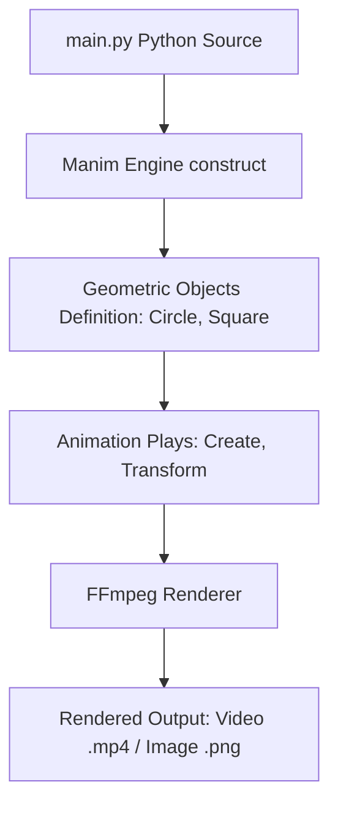

# Learn Manim

[](https://www.python.org/)
[](https://www.manim.community/)

## Table of Contents

- [Context](#-context)
- [Software features](#-software-features)
- [Technologies and tools](#-technologies-and-tools)
- [Architecture](#-architecture)
- [Repository structure](#-repository-structure)
- [Requirements](#-requirements)
- [How to run](#-how-to-run)
- [Author](#-author)

# 📌 Context 

This project is a repository dedicated to learning and practicing the Community Edition of **Manim** (Mathematical Animation Engine) in Python. It demonstrates how to create programmatic mathematical and visual animations using geometric shapes, transformations, and scene construct methods.

## 🚀 Software features

- **Basic Animation Scene (`main.py`):** Adds a circle and square, performs pause and remove actions, and runs a `Create` animation.
- **Morphing Transformation:** Demonstrates a smooth transition (`Transform`) morphing a circle shape into a blue square shape.
- **Advanced Animations (`main_2.py`, `main_3.py`):** Contains supplementary scenes showcasing other mathematical plots and transitions.

## 🛠️ Technologies and tools

- Python 3.10
- Manim (Community Edition Mathematical Animation Library)
- Anaconda / Conda (Environment management)
- FFmpeg (for video encoding/rendering backend)

## 📋 Architecture



## 📂 Repository structure

```text
- 📂 lab-practice-manim/
  - 📄 environment.yml (Conda environment dependency definition)
  - 📄 commands.md (Quick reference manual for Manim CLI parameters)
  - 📄 main.py (Circle-to-square morphing animation class `Animacao`)
  - 📄 main_2.py / main_3.py (Additional practicing scenes)
```

## 📦 Requirements

- Python 3.10+ or Anaconda/Miniconda installed
- FFmpeg (required backend library by Manim, typically included in Conda environment configuration)
- LaTeX (optional, for rendering mathematical formulas)

## ⚙️ How to run

### 1. Clone the Repository
Clone the repository to your local machine:
```bash
git clone https://github.com/MatheusRodri/lab-practice-manim.git
cd lab-practice-manim
```

### 2. Conda Environment Setup
Create and activate the environment containing all requirements from the `environment.yml` configuration:
```bash
conda env create -f environment.yml
conda activate manim_py
```
*(Conda is highly recommended for Manim as it installs python packages and system binaries like FFmpeg automatically).*

### 3. Render the Animation
Run the Manim command pointing to your script file and scene class name:
```bash
manim -pql main.py Animacao
```

**CLI Parameters Breakdown:**
- `-p`: Preview the video (automatically opens the video file when rendering finishes).
- `-q`: Select the render quality (`l` for low, `m` for medium, `h` for high, `k` for 4K).
- `l` quality: `-pql` renders low-resolution 480p 15fps quickly.
- `h` quality: `-pqh` renders high-resolution 1080p 60fps for final output.

## 👤 Author

Matheus Rodrigues 
[LinkedIn](https://linkedin.com/in/matheus-rodrigues-mrj) [GitHub](https://github.com/MatheusRodri)